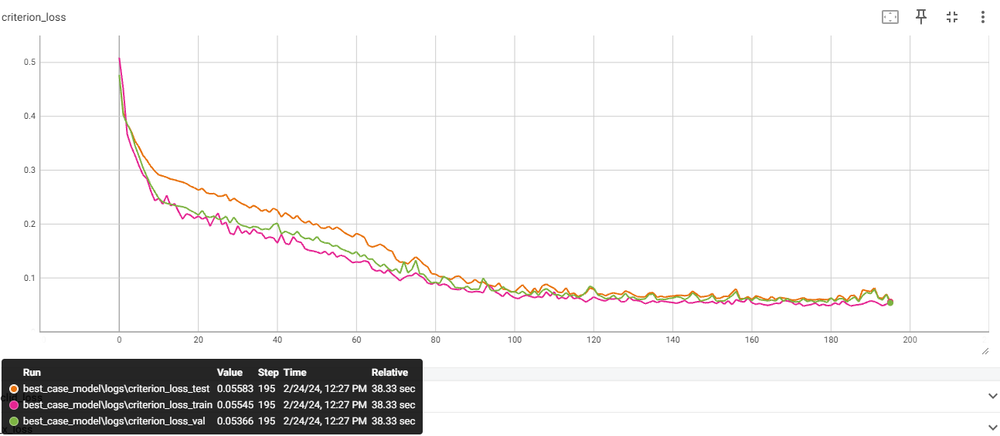
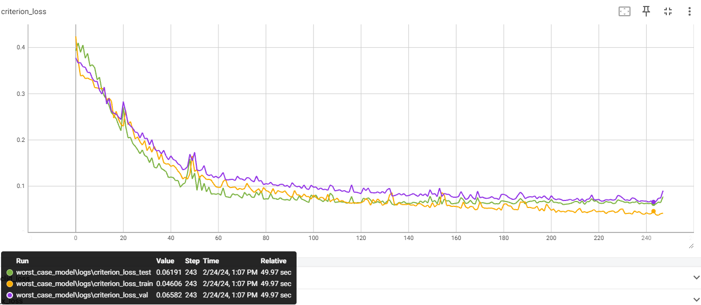

# EyeTracker

Predicts where you are looking at on your screen based on your webcam.

Strong focus on being able to do everything at once, i.e. you can generate data, train the model, and run inference (including GUI) all at the same time.

Features:

- Full problem coverage: from data generation, to training, to inference.
- Highly modular, designed to be a playground for the "eye tracking" problem.
- Supports tracking the gaze of multiple people at once (and seperating them).
- Supports [Active learning](https://en.wikipedia.org/wiki/Active_learning_(machine_learning)).
- Multiple sources of images available:
  - `webcam`: Uses your webcam to find faces
  - `screen`: Looks at your screen (i.e. a screenshot) to find faces
- Multiple source of ground truth available:
  - `simple-ball`: Ball that goes straight and bounces of the walls of your screen, with a bias towards bouncing to the sides.
  - `feedback-ball`: Ball that moves towards undersampled areas and areas with a high loss (this is a proof-of-concept for [Active learning](https://en.wikipedia.org/wiki/Active_learning_(machine_learning)), and is not refined)
  - `click-listener`: Records the mouse position when clicking.
- Robust to camera position, movement, lightning, reflections, ...

## Results

The loss function used is the euclidean distance (no clamping at the edges of the screen). Distance is conveyed as a percentage of the largest dimension of your screen (typically the width). The demonstrate the quality and robustness of the eye tracker, a reasonable best and worst case is discussed.

### Setup 1 (reasonable best-case)

- FOV: ~53 degrees (distance to screen = screen width)
- No glasses, even lighting
- No head movement (both rotationally and laterally)
- \# samples (train/val/test): 228/42/16

Results:

- Test loss: ~5.6%, which corresponds with ~1.9 cm or ~3.0 degrees.



### Setup 2 (reasonable worst-case)

- FOV: ~28 degrees (distance to screen = 2 * screen width)
- Glasses with substantial reflections, uneven ligthing
- Substantial head movement (both rotationally and laterally)
- \# samples (train/val/test): 258/44/17

Results:

- Test loss: ~6.2%, which corresponds with ~2.1 cm or ~1.8 degrees.



## Usage

Overview arguments:

- `--load_datasets [DATASET1 DATASET2 ...]`: Datasets used for training.
- `--save_dataset [DATASET]`: Dataset where newly generated samples are stored. A new dataset is created if the specified one does not exist.
- `--train`: enables training (off by default)
- `--inference`: enables inference (off by default)
- `--gt_source [SOURCE]`
- `--img_source [SOURCE]`
- `--model [MODEL]`: Name of model which is loaded/saved. If the model does not exist, a new model is created. If it does exist, the last checkpoint is loaded.
- `--device [DEVICE]`: torch device (e.g. "cuda" or "cpu")

Example usage 1 (recommended start case):

You want to finetune a pretrained model ("pretrained_default") while showing the inference results as the models evolves. Additionally, you want to save all new samples to "my_dataset".

```bash
python3 -m examples.eye_tracker.main --model pretrained_default --train --inference --save_dataset my_dataset --img_source webcam --gt_source simple-ball
```

Note that it is normal for this pretrained model to have a very high initial loss as this "pretrained_default" is not trained on a large variety of setups. For example, my camera is mounted on-top of my laptop.

Example usage 2 (most complex case):

You want to train a model ("myNewModel") from scratch live while showing the inference results as the model evolves. Additionally, you want to save all new samples and load some preexisting samples. The samples should be generated using a active learning based ground truth.

Warning, the feedback-ball is a proof-of-concept and not refined to fully exploit the data available for active learning.

```bash
python3 -m examples.eye_tracker.main --model myNewModel --train --inference --save_dataset my_dataset --load_dataset my_dataset --img_source webcam --gt_source feedback-ball  
```

Example usage 3:

You want to see the model learn live, without adding new samples.

```bash
python3 -m examples.eye_tracker.main --load_dataset my_dataset_1 my_dataset_2 --img_source webcam --model myModel --train --inference
```

Example usage 4:

You want to create a dataset without training a model or inference.

```bash
python3 -m examples.eye_tracker.main --save_dataset my_dataset --img_source webcam --gt_source simple-ball
```

Example usage 5:

You want to train a model without creating new samples, inference, or any gui

```bash
python3 -m examples.eye_tracker.main --model myModel --load_dataset my_dataset_1 my_dataset_2 --train
```

## Architecture

A rough outline of the project structure is shown below for the feedback-ball case. Depending on the passed arguments, some objects/connections might dissapear or change.


## Misc

- Epoch numbers are highly inflated as the training data grows over time. Recently created data will not be included in all epochs.
- Training happens in burts, the burst eventually stops when validation loss increases. After a burst, the model waits for more samples before starting a new burst.
- During training bursts, the model's inference speed is severly limited.
