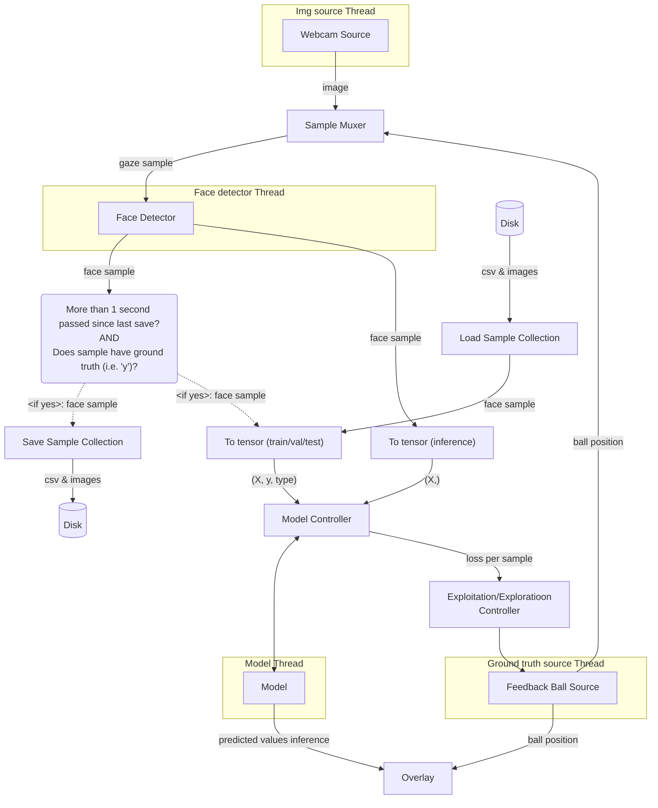

# EyeTracker

Predict where you are looking at on your screen based on your webcam.

Strong focus on being able to do everything at once, i.e. you can generate data, train the model, and run inference (including GUI) all at the same time.

Features:

- Multiple sources of ground truth available.
- Support for multiple people in frame at once.
- Model can be trained "on the go".
- 

## Results

Loss function is the euclidean distance without clamping to the edges of the screen. Distance is conveyed as a percentage of the width of the screen.
Results vary greatly depending on your setup, a reasonable best and worst case is discussed.

### Setup 1 (best-case)

- FOV: ~53 degrees (distance to screen = screen width)
- No glasses, even lighting
- No head movement (both rotationally and laterally)

Results:

- Test loss: ~X% , corresponds  ()


### Setup 2 (worst-case)

- FOV: ~28 degrees (distance to screen = 2 * screen width)
- Glasses with substantial reflections, uneven ligthing
- Substantial head movement (both rotationally and laterally)

Results:

- Test loss: ~X%

## Usage

Overview arguments:

- `--load_datasets [DATASET1 DATASET2 ...]`
- `--save_dataset [DATASET]`
- `--train`: enables training (off by default)
- `--inference`: enables inference (off by default)
- `--gt_source [SOURCE]`
- `--img_source [SOURCE]`
- `--model [MODEL]`: Model name, 
- `--device [DEVICE]`: torch device

Example usage:

```bash
python3 -m examples.eye_tracker.main --load_dataset my_dataset --save_dataset my_dataset --img_source webcam --gt_source simple-ball --model myModel --train --inference
```

This will:

- 

## Architecture



## Misc

- Epoch numbers are highly inflated as the training data grows over time. Data added later will be used far less overall than the data initially added.
- Support for a form of [Active learning](https://en.wikipedia.org/wiki/Active_learning_(machine_learning)), e.g. move the ball towards areas with high errors or the are undersampled, 