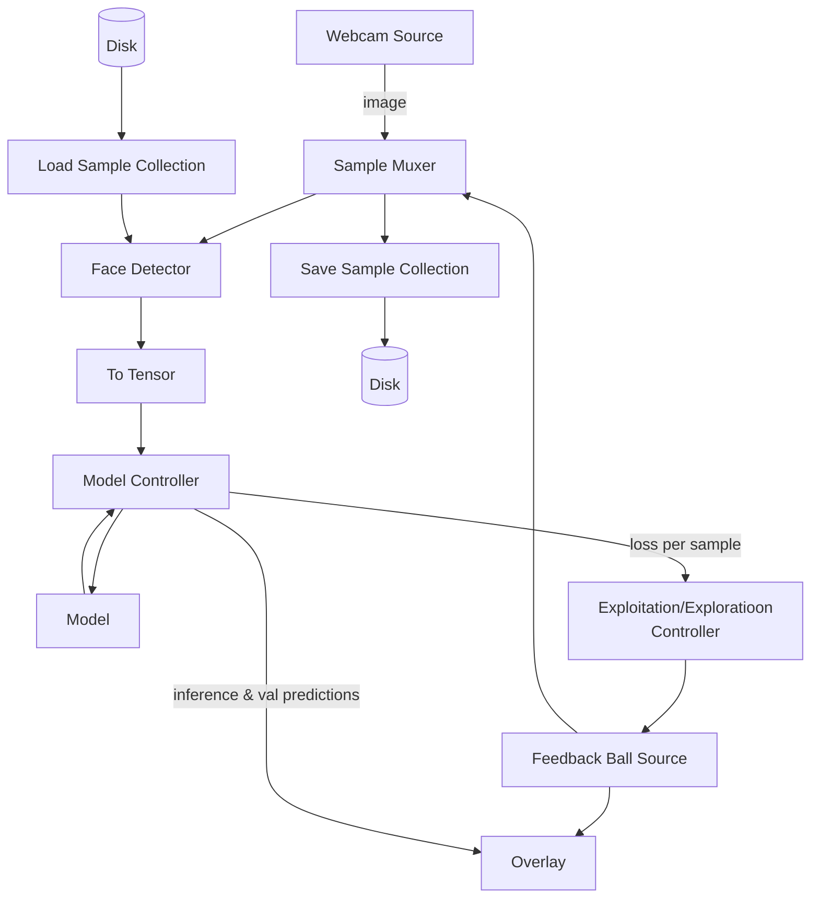

# EyeTracker

Predict where you are looking at on your screen based on your webcam. Strong focus on being able to do everything at once, i.e. you can generate data, train the model, and run inference (including GUI) all at the same time.

Features:

- Multiple sources of ground truth available.
- Support for multiple people in frame at once.
- Model can be trained "on the go".
- Supports [Active learning](https://en.wikipedia.org/wiki/Active_learning_(machine_learning)), made possible by the live training nature.

## Results

Setup:

- 15.6 inch laptop screen
- ~25 inch viewing distance
- 0 starting training samples
- x seconds of tracking the ball

Results:

- average euclidean distance error of ~6% of the width of the screen, corresponds to approximately 0.8 inches (2 cm)

## Usage

```bash
python3 -m examples.eye_tracker.main --load_dataset my_dataset --save_dataset my_dataset --img_source webcam --gt_source simple-ball --model myModel
```


