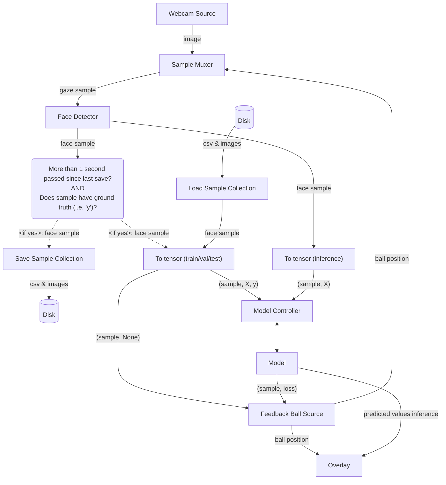

# EyeTracker

Predicts where you are looking at on your screen based on your webcam.

Strong focus on being able to do everything at once, i.e. you can generate data, train the model, and run inference (including GUI) all at the same time.

Features:

- Highly modular, designed to be a playground for the "Eye tracking" problem.
- Multiple sources of ground truth available.
- Support for multiple people in frame at once.
- Supports [Active learning](https://en.wikipedia.org/wiki/Active_learning_(machine_learning)), a proof-of-concept ("feedback-ball") is implemented where the ball moves towards areas that are undersampled and/or have high errors.

## Results

The loss function used is the euclidean distance (no clamping at the edges of the screen). Distance is conveyed as a percentage of the width of the screen.
Results vary greatly depending on your setup, a reasonable best and worst case is discussed.

### Setup 1 (reasonable best-case)

- FOV: ~53 degrees (distance to screen = screen width)
- No glasses, even lighting
- No head movement (both rotationally and laterally)

Results:

- Test loss: ~X% , corresponds  ()

### Setup 2 (reasonable worst-case)

- FOV: ~28 degrees (distance to screen = 2 * screen width)
- Glasses with substantial reflections, uneven ligthing
- Substantial head movement (both rotationally and laterally)

Results:

- Test loss: ~X%

## Usage

Overview arguments:

- `--load_datasets [DATASET1 DATASET2 ...]`
- `--save_dataset [DATASET]`
- `--train`: enables training (off by default)
- `--inference`: enables inference (off by default)
- `--gt_source [SOURCE]`
- `--img_source [SOURCE]`
- `--model [MODEL]`: Model name, 
- `--device [DEVICE]`: torch device

Example usage 1 (most complex case):
You want to train a model (from scratch) live while showing the inference results as the model evolves. Additionally, you want to save all new samples and load some preexisting samples.

```bash
python3 -m examples.eye_tracker.main --load_dataset my_dataset --save_dataset my_dataset --img_source webcam --gt_source simple-ball --model myModel --train --inference
```

Example usage 2:
You want to see the model learn live, without creating new samples or a ground truth source.

```bash
python3 -m examples.eye_tracker.main --load_dataset my_dataset_1 my_dataset_2 --img_source webcam --model myModel --train --inference
```

Example usage 3:
You want to create a dataset without training a model, inference, or any gui.

```bash
python3 -m examples.eye_tracker.main --save_dataset my_dataset --img_source webcam --gt_source simple-ball
```

Example usage 4:
You want to train a model without creating new samples, inference, or any gui

```bash
python3 -m examples.eye_tracker.main --load_dataset my_dataset_1 my_dataset_2 --train
```

This will:

- 

## Architecture

The most complex/complete graph is shown below. Depending on the passed arguments, some objects/connections might dissapear.



## Misc

- Epoch numbers are highly inflated as the training data grows over time. The more recently the data was created the less the data will have been used.
- Training happens in burts, the burst is as long as the validation loss decreases. After a burst, the model waits for more samples.
- During these bursts, the model is training and the inference speed is severly limited.